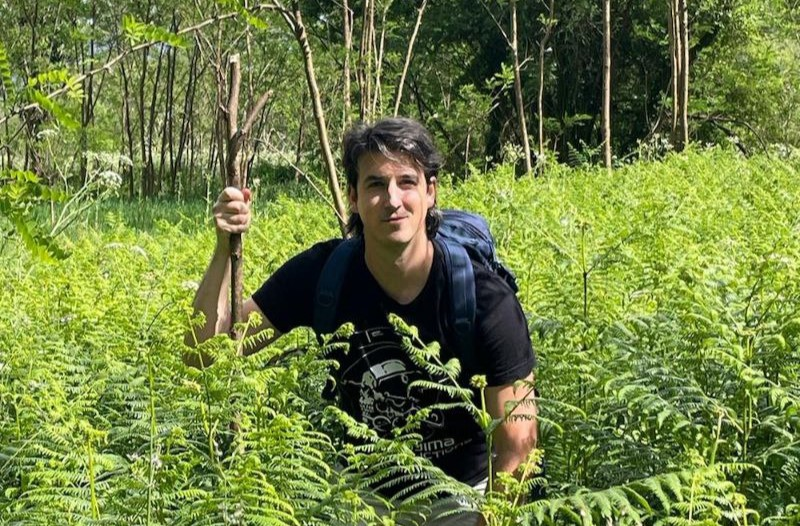

# ¡Un DESARROLLADOR salvaje apareció!

## ¿Quien? ¿Yo? 
Hola! 👋 Me llamo Arturo, **Arturo Ramos**. Este perfil de GitHub de momento está siendo un poco campo de pruebas para manejarme con soltura en esto de los entornos de desarrollo que dominan el mercado. Esperemos que me vaya bien.

## Enlaces de interés

[Guía Primeros Pasos con GitHub (Reto Entornos de Desarrollo)](https://github.com/grisllo/retoGitArturoRamos)

## Habilidades 
- Natural y digital
- Gimme Knowledge!
- ✨✨✨✨✨✨✨✨✨✨✨
<!--
## Instalación 
Instrucciones para instalar y configurar el proyecto. 

## Uso 
Guía rápida sobre cómo utilizar el proyecto y ejemplos de código. 

## Contribución 
Información sobre cómo contribuir al proyecto, directrices para enviar pull requests y reportar issues. 

## Licencia 
Licencia bajo la cual se distribuye el proyecto.

<!--
**grisllo/grisllo** is a ✨ _special_ ✨ repository because its `README.md` (this file) appears on your GitHub profile.

Here are some ideas to get you started:

- 🔭 I’m currently working on ...
- 🌱 I’m currently learning ...
- 👯 I’m looking to collaborate on ...
- 🤔 I’m looking for help with ...
- 💬 Ask me about ...
- 📫 How to reach me: ...
- 😄 Pronouns: ...
- ⚡ Fun fact: ...
-->
